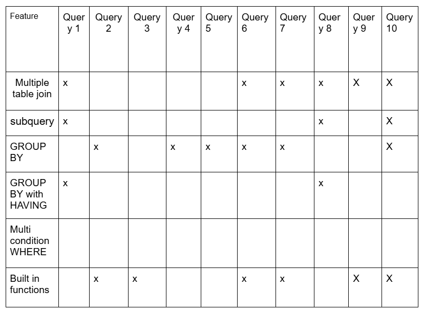
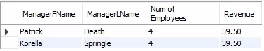
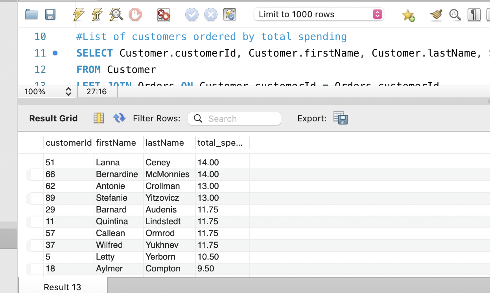
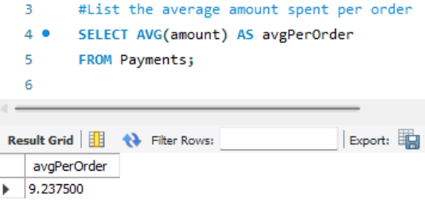
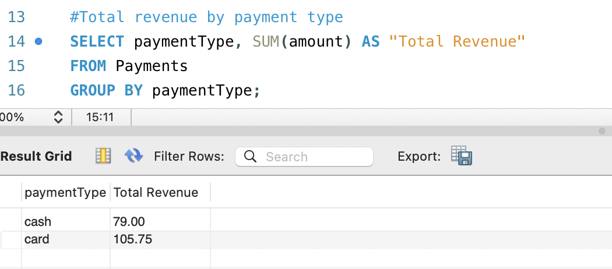
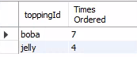
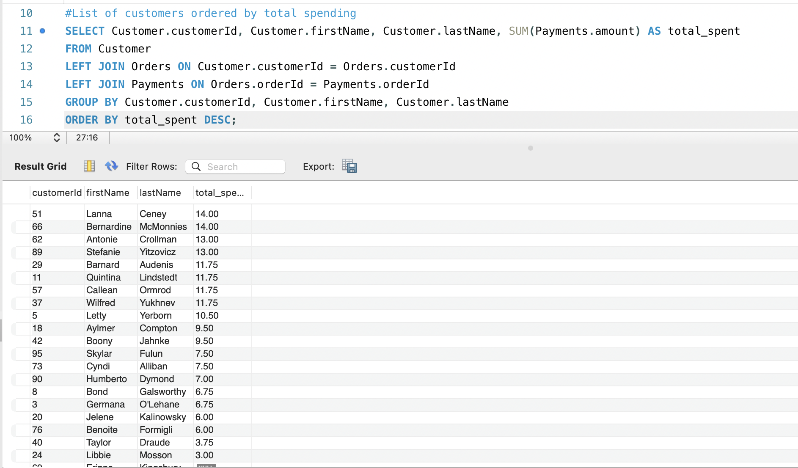
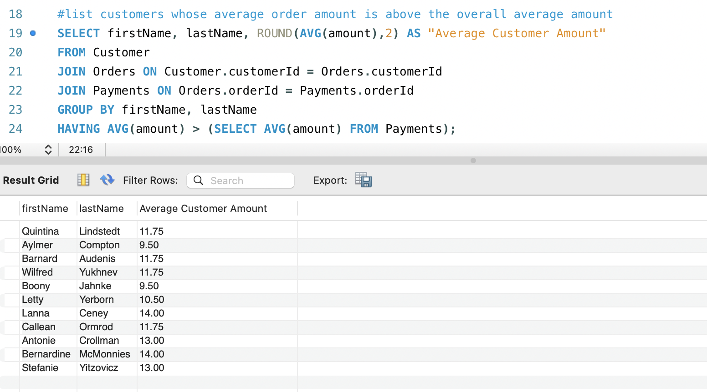
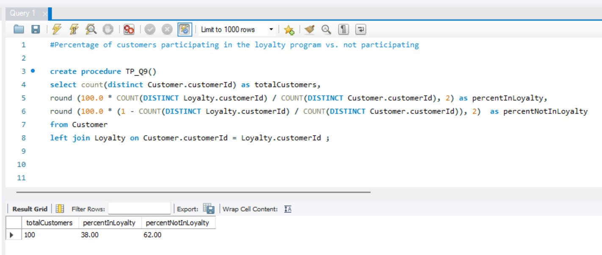
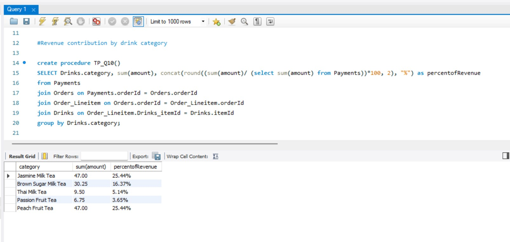

# Team Name
59925_GroupProject1 - Tapioca Chews 

# Team Members 
1. Jay Tran
2. Sulema Gonzalez
3. Iris Huang
4. Abby Simmavanh
5. Julia Tardy

# Scenario
Tapioca Chews is a small but growing bubble tea shop located in downtown Athens. They’ve recently expanded their operations, adding online ordering, new fruit tea drinks, and new employees. Up to now they’ve been keeping track of orders and inventory using spreadsheets, but as the business grows, it’s becoming hard to manage efficiently and as questions arise such as order questions it is hard to answer. To modernize their operations, the owners want us to create an SQL database that stores and tracks all the key information about their business.
Since there is only one store location for Tapioca Chews, the owner wants to keep track of customers, menu items, orders, drinks, food, drink customizations, loyalty, payments, employees, and suppliers. More specifically, for customers, we want their first name, last name, phone, and email. For menu items we want drinks and food. For orders, we want to store the customer involved, the employee involved, and the time the interaction took place. As a small boba shop, we only have 2 bases: milk tea and fruit tea. We also offer food in two categories: dessert and appetizers. Tapioca Chews also offers add-ons for various prices. To encourage customer returns, we have started a rewards program and will need to track a customer’s points balance and the date they enrolled in the loyalty program. With that being said, we also need to collect information about payments made, such as the date, the payment type, and whether the amount was paid in full. In order to run Tapioca Chews, we need employees and we want to track employee first name, last name, phone, address, date starting, pay rate. 

# Entities 
1. Customers
2. Menu Items
3. Orders
4. Drinks
5. Food
6. Drink_Customizations
7. Loyalty
8. Payments
9. Employee
10. Tapioca_Chews

# Data Model 
Explanation of Data Model: 

Our model is a hypothetical Boba Shop named Tapioca Chews. The Tapioca_Chews entity represents the physical store, which contains a unique storeId, street, city, and zipcode. Currently, the owners of Tapioca Chews have a singular brick-and-mortar location. That singular location contains many employees, which is why we have established a non-identifying one-to-many relationship, because the location can still exist without employees. Each Employee has their own unique employee number (empNo) as well as information stored on the employee, such as first name (firstName), last name (lastName), phone, and address. Additionally, there is a supervisor (superNo), and they are an employee who also manages other employees, which is why there is a recursive relationship. 

Each employee can take many orders from a customer, and the customer can also place multiple orders, which creates the associative entity “Orders”. In the Orders entity, we have a unique orderId as well as a TIMESTAMP for the date the order was made. The Customer entity contains a unique customerId, their last name (lastName), their first name (firstName), their phone, and email. One customer is allowed a singular loyalty account, which creates an identifying one-to-one relationship because there can not be a loyalty account for a customer who does not exist. In the Loyalty entity, we have their points balance (pointBal). 

Every order can have many items within that order, which generates an identifying one-to-many relationship, as the order can not exist without the order items. We have Drinks, Food, and Drink_Customizations entities that feed into the Order_Lineitem entity, which creates three one-to-many non-identity relationships, as you do not have to order everything, and null values are acceptable. The Drink_Customizations entity has a toppingId primary key as well as a price attribute. The Drinks entity has an itemId (PK) and attributes of category and price. The Food entity has a foodId (PK) and a foodName, and a price. 

At the end of the order, we expect payments, which lead to the creation of the Payments entity. This entity has a non-identifying one-to-many relationship with Orders because you can use multiple forms of payment for the same order. The attributes in the entity are as follows: paymentType, amount, and paidDate, as well as a unique paymentId. 

# SQL Queries 

1. List number of employees under each manager and how much revenue they generated (complex)  
Query 1 lets the owners see the performance of their managers and how much revenue their team has generated over a lifetime.

2. List Drinks in order of most to least popular (simple)  
Query 2 allows the owners of Tapioca Chews to see our most ordered drink so we can plan accordingly for our order, such as ordering in correct increments, ordering less of one flavor and more of another. 

3. List the average amount spent per order (simple) 

Query 3 allows the owners to see the average amount spent per order so they can have a better understanding of customer spending habits and plan accordingly. For example, if customers are spending more than usual, they can plan to have more ingredients in stock. If customers are spending less than usual, they can decide if they want to offer promotions and deals to encourage them to place larger orders.

4. List the total revenue by payment type (simple) 
Query 4 calculates the total amount of revenue generated for each payment type (cash and credit). It helps identify which payment methods are most popular with customers and contribute the most to overall sales. Understanding these patterns allows the store manager to see customer preferences and make decisions about which payment options to focus on or improve.  

5. List the toppings ordered by most to least popular (complex)  
Query 5 returns which topping is currently being ordered the most and the least to determine which topping they need to order more or less of.

6. List the top customer by total spending (complex)  
Query 6 allows us to see who our top customers are by measurement of total amount of money spent at Tapioca Chews so we can potentially make note of that and when they come in provide them with a reward or build a stronger relationship with them so that through word of mouth we can grow. 

7. List the employees who have taken the most to least orders, if employees have the same number of orders, have employees be sorted further from most to least revenue (complex) 
Query 7 allows the owners to see which employees are taking the most orders, sorted from most to least, and if tied, by their total revenue most to least. This helps the owners identify top-performing employees and plan work schedules as they can assign busy shifts to employees who can handle high order volumes well. It also allows the owners to identify the employees who generate the most revenue for the shop, which could help with the future training of new employees as they can see how the top employees encourage customers to spend more.

8. List the customer names and amounts whose average order amount is above the overall average amount(complex) 
Query 8 lists the customers whose average order amount is greater than the overall average amount across all orders. This helps the manager establish which customers are spending above average. With this information, they could cater to those specific customers by offering more loyalty points, discounts, or deals to keep them engaged.  

9. Percentage of customers participating in the loyalty program vs. not participating (complex) 
Query 9 shows the total number of customers that have been to Tapioca Chews, the percentage who are part of the loyalty program, and the percentage of those who aren’t. From a managerial perspective, this helps evaluate how effective the loyalty program is for customers. Since we have a low percentage for those in the loyalty program, the manager might look for ways to promote and improve this program so that more customers are encouraged to join.

10. Revenue contribution by drink category (complex) 
Query 10 lists out the drinks by their category, the total amount they have earned for the shop, and the percentage that amount is to the overall revenue of Tapioca Chews. This query is important as it allows the owners to identify the most popular drinks to better prepare their inventory for the future.
# Data Dictionary
1. Customer:

2. Drink Customization:

3. Drinks:

4. Employee:

5. Food:

6. Loyalty:

7. Order Lineitem:

8. Orders:

9. Payments:

# Data Base Information 
ns_F25MIST4610_59925_Group6

Additional information: Each query listed above is marked in the database using stored procedures which can be called using the following format: CALL TP_QX();
